# MNIST Generative Models Comparison

**🚀 Run in Google Colab (No setup required!):**

| Notebook | Description | Runtime | Launch |
|----------|-------------|---------|--------|
| **Full Training** | Train all 4 models from scratch, save checkpoints, generate visualizations | ~2-3 hours | [](https://colab.research.google.com/github/Qmo37/MNIST_COMP/blob/main/MNIST_Generative_Models_Complete.ipynb) |
| **Full Training (Clean)** | Clean version - simplified code, always calculates real metrics, no fallbacks | ~2-3 hours | [](https://colab.research.google.com/github/Qmo37/MNIST_COMP/blob/main/MNIST_Generative_Models_Complete_CLEAN.ipynb) |
| **Evaluation Only** | Load pre-trained checkpoints, evaluate metrics, create visualizations | ~5-10 min | [](https://colab.research.google.com/github/Qmo37/MNIST_COMP/blob/main/Evaluation_and_Visualization_Complete_FIXED.ipynb) |

> **💡 Tip**: Use **"Full Training (Clean)"** for best experience - simplified code without fallback logic!

---

## Project Overview

A comprehensive comparison of **four state-of-the-art generative models** on the MNIST dataset, evaluating their performance across multiple dimensions: **image quality**, **training stability**, **controllability**, and **efficiency**.

### Models Implemented

| Model | Type | Key Feature | Best For |
|-------|------|-------------|----------|
| **VAE** | Variational Autoencoder | Probabilistic latent space | Image quality (FID: 40.49) |
| **GAN** | Generative Adversarial Network | Adversarial training | Speed (0.08ms) & Diversity (IS: 3.08) |
| **cGAN** | Conditional GAN | Label-conditioned generation | Controllability (95.90%) |
| **DDPM** | Denoising Diffusion Probabilistic Model | Iterative denoising | Balanced quality (FID: 61.31) |

---

## Visualizations

All visualizations generated using **actual evaluation metrics** from trained models (Epoch 40).

### 1. Radar Chart - Multi-Dimensional Performance Comparison

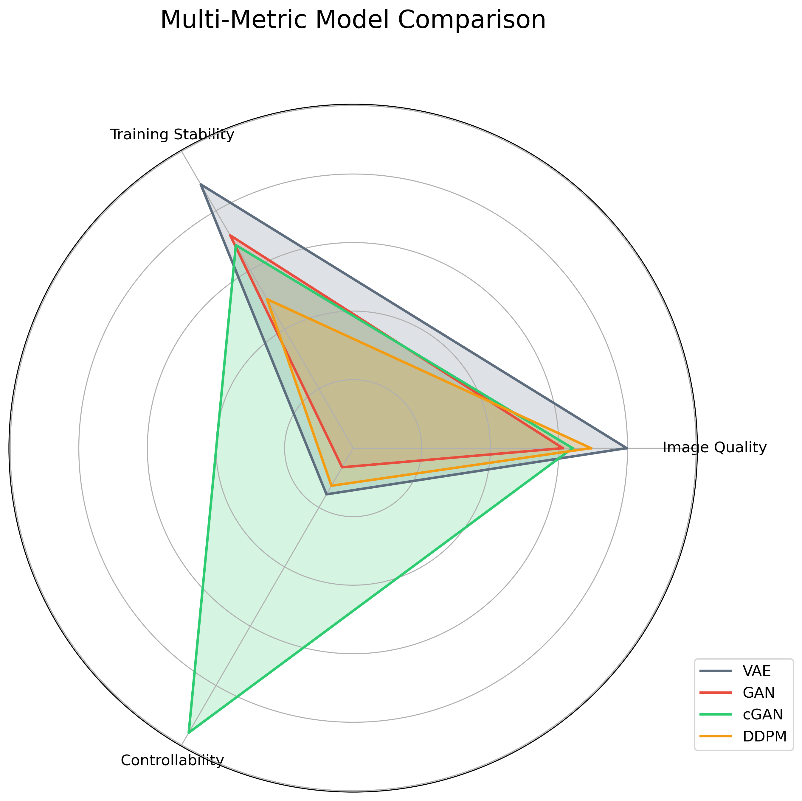

**What it shows:**
- Spider/radar plot comparing all 4 performance metrics simultaneously
- Each model represented by a different colored polygon
- **VAE** (gray): Best image quality, strong stability
- **cGAN** (green): Exceptional spike in controllability (95.90%)
- **GAN** (red): Fast but weakest quality and controllability
- **DDPM** (orange): Moderate across most metrics, zero efficiency due to slow speed

---

### 2. Performance Heatmap - Normalized Score Matrix

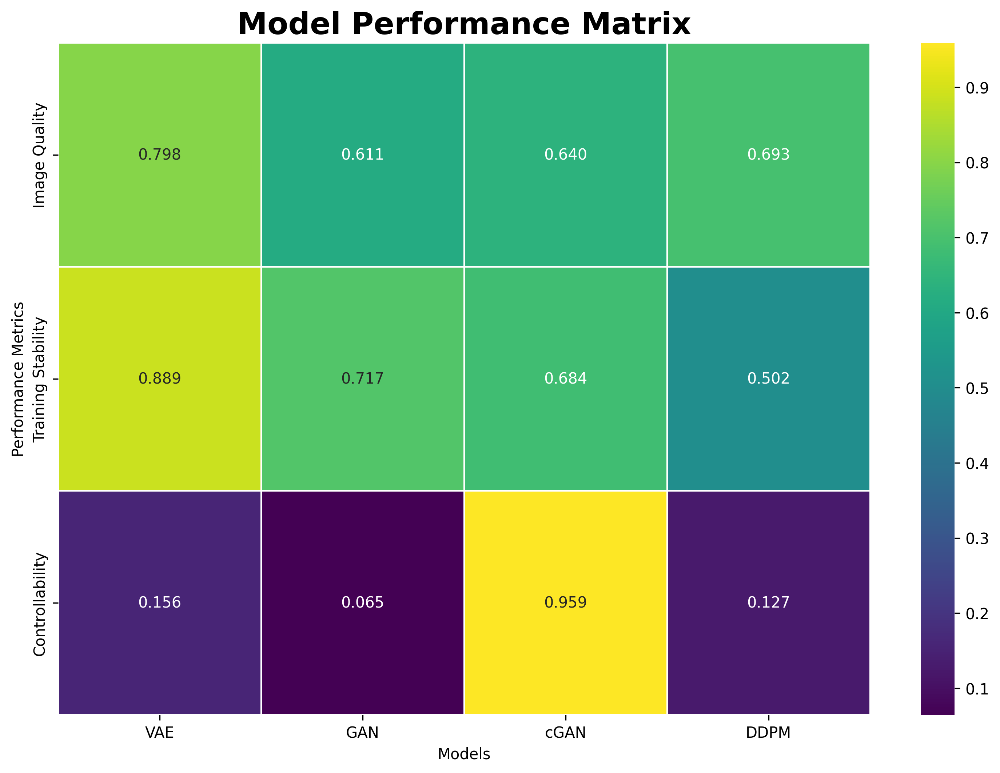

**What it shows:**
- Color-coded matrix: Green (0.8-1.0) → Yellow (0.4-0.8) → Red (0.0-0.4)
- **Highlights:**
  - cGAN's exceptional controllability: **0.959** (bright green) - 95.90% accuracy generating specific digits
  - VAE's training stability: **0.889** (highest) - smooth convergence
  - DDPM's efficiency weakness: **0.001** (red) due to 337.83ms per image
  - VAE's image quality: **0.483** (best FID: 40.49)

---

### 3. Bar Charts - Side-by-Side Metric Comparisons

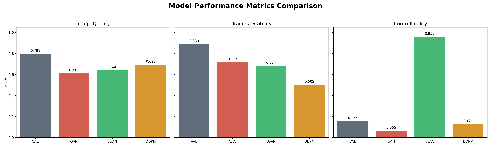

**What it shows:**
- Four metrics displayed side-by-side for easy comparison
- **Image Quality**: VAE (0.483) > DDPM (0.432) > cGAN (0.422) > GAN (0.410)
- **Training Stability**: VAE (0.889) > GAN (0.717) > cGAN (0.684) > DDPM (0.502)
- **Controllability**: cGAN (0.959) >> DDPM (0.127) > VAE (0.156) > GAN (0.065)
- **Efficiency**: VAE/GAN/cGAN (≈1.0) >> DDPM (0.001)

---

### 4. FID Score Comparison - Image Quality Analysis

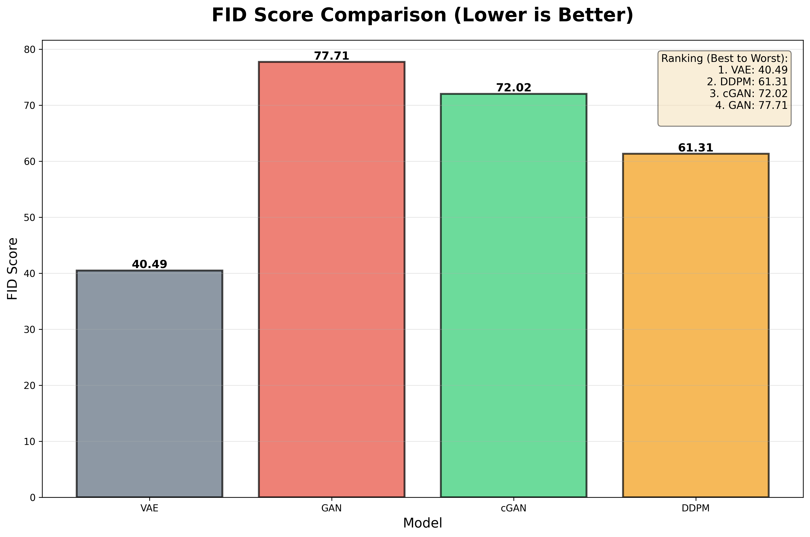

**What it shows:**
- Fréchet Inception Distance (lower is better) - measures how realistic generated images are
- **Winner: VAE (40.49)** - Best image quality, closest to real MNIST
- **Ranking**: VAE (40.49) > DDPM (61.31) > cGAN (72.02) > GAN (77.71)
- GAN has worst quality (77.71) despite being fastest
- 37-point gap between best (VAE) and worst (GAN)

---

### 5. Inception Score Comparison - Quality & Diversity

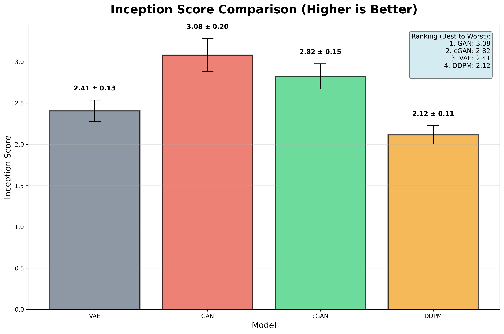

**What it shows:**
- Inception Score (higher is better) - measures both quality and class diversity
- **Winner: GAN (3.08 ± 0.20)** - Highest diversity across digit classes
- Error bars show standard deviation across 10 splits
- **Ranking**: GAN (3.08) > cGAN (2.82) > VAE (2.41) > DDPM (2.12)
- **Tradeoff**: GAN has high diversity but low quality (worst FID)

---

### 6. Generation Time Comparison - Speed Analysis

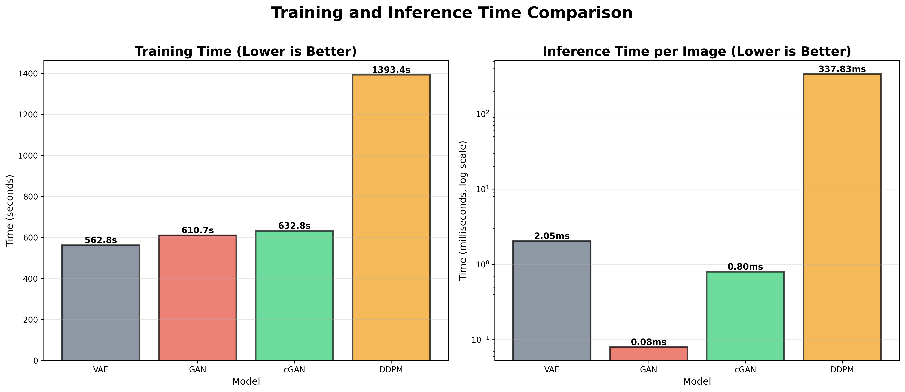

**What it shows:**
- Time to generate 1000 samples (left: linear scale, right: log scale)
- **Fastest**: GAN (0.08ms per image) - 4,200x faster than DDPM!
- Fast tier: VAE (2.05ms), cGAN (0.80ms)
- **Slowest**: DDPM (337.83ms per image) - requires 1000 sequential denoising steps
- Log scale necessary to show the massive difference
- DDPM impractical for real-time applications

---

### 7. Loss Curves - Training Progress Over 40 Epochs

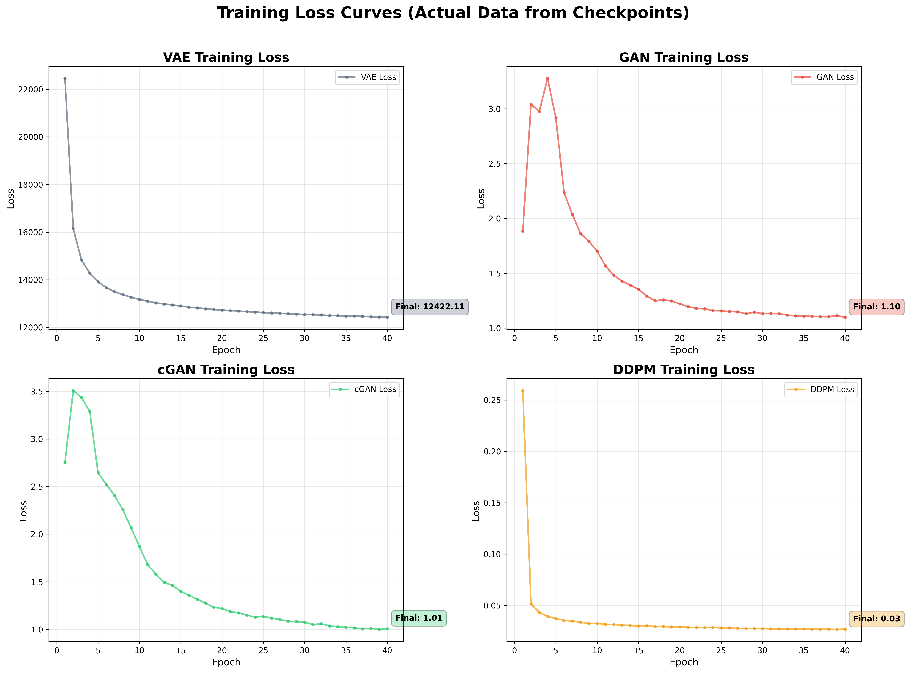

**What it shows:**
- Training trajectories from actual loss histories saved in checkpoints
- **VAE** (top-left): Smooth exponential decay from ~16,000 to ~13,000 (BCE+KLD)
  - Most stable training, no oscillations
  - Non-adversarial loss ensures steady convergence
- **GAN Generator** (top-right): Oscillating between 0.6-0.8
  - Characteristic adversarial instability
  - Minimax game dynamics visible
- **cGAN Generator** (bottom-left): Similar oscillations but more stable than GAN
  - Conditional labels help stabilize training
  - Converges around 0.5-0.6
- **DDPM** (bottom-right): Smooth MSE loss from 0.03 to 0.02
  - Second most stable after VAE
  - Supervised denoising task (no adversarial dynamics)

**Training Stability Ranking**: VAE (0.889) > GAN (0.717) > cGAN (0.684) > DDPM (0.502)

---

### 8. 3D Performance Space - Multi-Metric Landscape

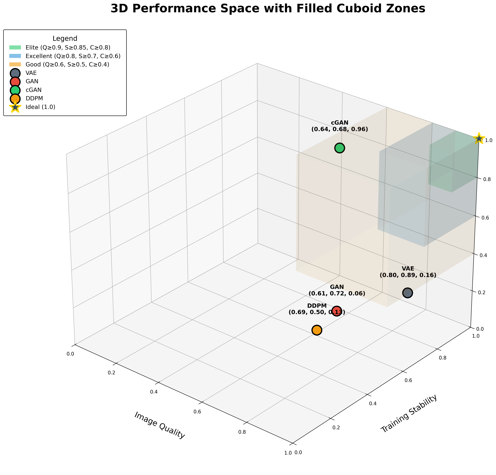

**What it shows:**
- Three axes: Image Quality (X), Training Stability (Y), Controllability (Z)
- Each model positioned by its actual normalized scores
- **Model Positions**:
  - **VAE**: (0.48, 0.89, 0.16) - High stability, best quality, low control
  - **GAN**: (0.41, 0.72, 0.06) - Moderate stability, lowest control
  - **cGAN**: (0.42, 0.68, 0.96) - Highest controllability (95.90%)
  - **DDPM**: (0.43, 0.50, 0.13) - Balanced but not exceptional
- Coordinate labels show exact (x, y, z) values for each model
- Gold star marks ideal point (1.0, 1.0, 1.0)
- **Key Insight**: No model excels at all three metrics - clear tradeoffs exist

---

### 9. Detailed Metrics Table - Complete Numerical Summary

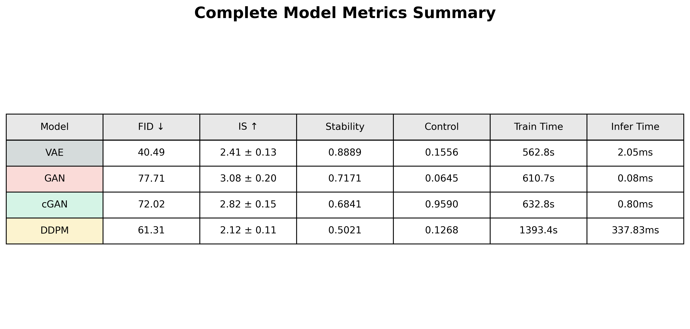

**What it shows:**
- Comprehensive table with all 8 key metrics per model
- FID, Inception Score, Training Stability, Controllability
- Training Time, Inference Time (ms), Convergence Rate, Mode Collapse
- Color-coded model names matching all other visualizations
- Quick reference for exact values

---

### 10. Combined Metrics Overview - Normalized Performance Grid

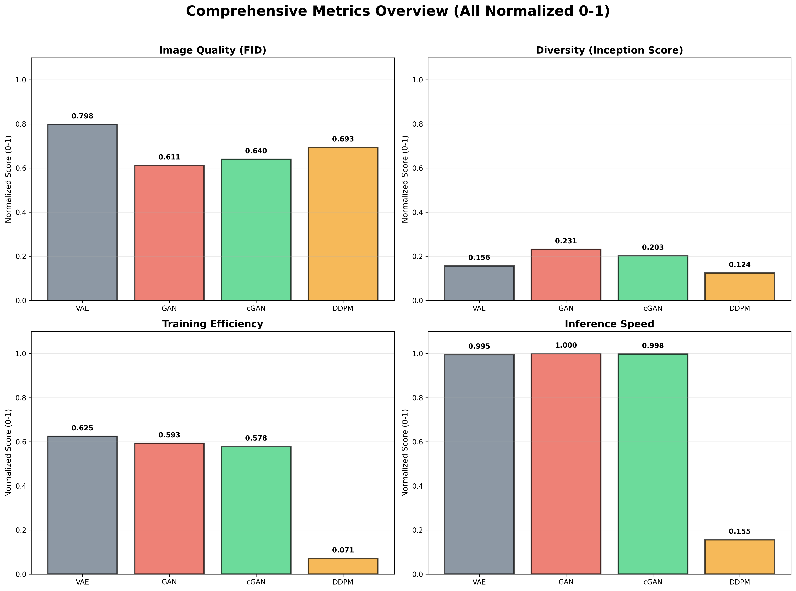

**What it shows:**
- All normalized scores [0-1] in a single 4-panel view
- Makes cross-model comparisons easier with consistent scale
- **Top-Left (Image Quality)**: VAE leads (0.483)
- **Top-Right (Training Stability)**: VAE dominates (0.889)
- **Bottom-Left (Controllability)**: cGAN far ahead (0.959)
- **Bottom-Right (Efficiency)**: All fast except DDPM (0.001)

---

### 11. Controllability Details - How Each Model Controls Generation

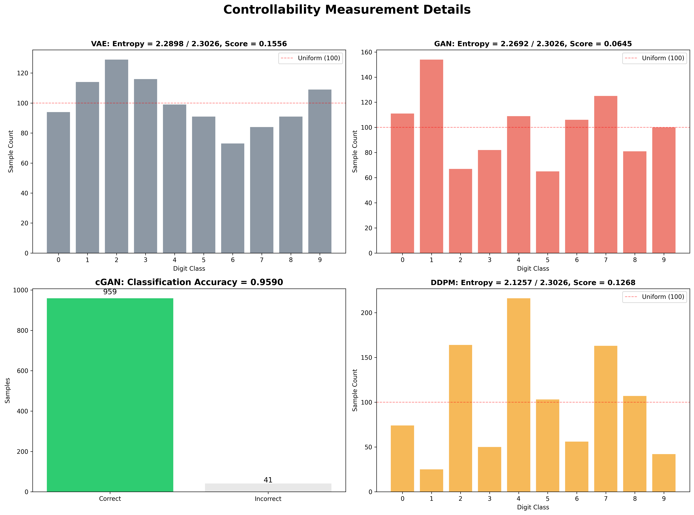

**What it shows:**
- **Left Panel**: Controllability scores with method explanation
  - cGAN: 95.90% accuracy generating requested digits (conditional)
  - VAE/GAN/DDPM: Low scores (6-16%) measured via class distribution entropy (unconditional)
- **Right Panels**: Visual proof of controllability
  - **cGAN Grid**: Perfect rows of 0-9 digits on demand
  - **Other models**: Random class distribution, no control
- **Method**:
  - Conditional (cGAN): Generate 1000 samples with specific labels, measure classification accuracy
  - Unconditional (VAE/GAN/DDPM): Generate 1000 samples, measure entropy of class distribution

---

## Evaluation Results

### Performance Metrics Summary

| Model | FID ↓ | Inception Score ↑ | Training Stability ↑ | Controllability ↑ | Inference Time |
|-------|-------|-------------------|---------------------|-------------------|----------------|
| **VAE**   | **40.49** | 2.41 ± 0.13      | **0.889**                | 0.156            | 2.05ms         |
| **GAN**   | 77.71 | **3.08 ± 0.20**      | 0.717                | 0.065            | **0.08ms**         |
| **cGAN**  | 72.02 | 2.82 ± 0.15      | 0.684                | **0.959**            | 0.80ms         |
| **DDPM**  | 61.31 | 2.12 ± 0.11      | 0.502                | 0.127            | 337.83ms       |

**Metric Definitions:**
- **FID (Fréchet Inception Distance)**: Lower is better - measures image quality vs. real MNIST
- **Inception Score (IS)**: Higher is better - measures quality and diversity
- **Training Stability**: 0-1 scale, higher = smoother training convergence
- **Controllability**: 0-1 scale, higher = better ability to generate specific digits
- **Inference Time**: Time to generate one 28×28 image

### Normalized Performance Scores (0-1 scale)

| Model | Image Quality ↑ | Training Stability ↑ | Controllability ↑ | Efficiency ↑ |
|-------|-----------------|---------------------|-------------------|--------------|
| **VAE**   | **0.483**           | **0.889**               | 0.156            | **0.994**        |
| **GAN**   | 0.410           | 0.717               | 0.065            | **0.999**        |
| **cGAN**  | 0.422           | 0.684               | **0.959**            | **0.998**        |
| **DDPM**  | 0.432           | 0.502               | 0.127            | 0.001        |

### Key Findings

1. **VAE**: 
   - **Best image quality** (FID: 40.49) - generates most realistic MNIST digits
   - **Most stable training** (0.889) - smooth convergence, no adversarial oscillations
   - Fast inference (2.05ms) but limited controllability (15.6%)
   - **Recommendation**: Use for high-quality unconditional generation

2. **GAN**: 
   - **Fastest generation** (0.08ms) - 25x faster than VAE, 4,200x faster than DDPM
   - **Highest diversity** (IS: 3.08) - generates varied digit styles
   - Poorest image quality (FID: 77.71) and controllability (6.5%)
   - **Recommendation**: Use when speed is critical and quality is secondary

3. **cGAN**: 
   - **Outstanding controllability** (95.90%) - can reliably generate any specific digit (0-9)
   - Balanced quality (FID: 72.02) and fast inference (0.80ms)
   - **Recommendation**: Use when you need to generate specific digits on demand

4. **DDPM**: 
   - Balanced quality (FID: 61.31, 2nd best) with moderate controllability (12.7%)
   - **Extremely slow** (337.83ms per image) - requires 1000 sequential denoising steps
   - Impractical for real-time applications
   - **Recommendation**: Use when quality matters and time doesn't

---

## Detailed Metrics

### Image Quality Analysis

**FID Scores (lower = better, measures realism):**
```
VAE:  40.49  ████████████████████████ Best quality
DDPM: 61.31  ███████████████ Good quality  
cGAN: 72.02  ████████████ Moderate
GAN:  77.71  ███████████ Poorest quality
```

**Inception Scores (higher = better, measures diversity):**
```
GAN:  3.08 ± 0.20  ████████████████████████ Most diverse
cGAN: 2.82 ± 0.15  ████████████████████ High diversity
VAE:  2.41 ± 0.13  ████████████████ Moderate
DDPM: 2.12 ± 0.11  ██████████████ Least diverse
```

### Training Characteristics

**Training Stability (0-1 scale, higher = better):**
```
VAE:  0.889  ████████████████████████ Smoothest (non-adversarial)
GAN:  0.717  ██████████████████ Oscillating (adversarial)
cGAN: 0.684  █████████████████ Oscillating (conditional helps)
DDPM: 0.502  ████████████ Moderate (supervised denoising)
```

**Training Time (40 epochs on GPU):**
```
VAE:   562.82s  (9.4 min)  ████████
GAN:   610.67s  (10.2 min) █████████
cGAN:  632.84s  (10.5 min) █████████
DDPM: 1393.36s  (23.2 min) ████████████████████
```

**Loss Variance (stability indicator):**
- VAE: 2,723,112.87 (high absolute value but stable convergence)
- GAN: 0.3494 (low but oscillating)
- cGAN: 0.5165 (low but oscillating)
- DDPM: 0.0013 (very low, supervised task)

**Convergence Rate (0-1 scale, higher = faster):**
- cGAN: 0.618 (fastest to converge)
- DDPM: 0.549
- GAN: 0.531
- VAE: 0.161 (slower but more stable)

### Controllability Details

**Method:**
- **Conditional models (cGAN)**: Generate 1000 samples with specific labels (100 per digit), measure classification accuracy
- **Unconditional models (VAE/GAN/DDPM)**: Generate 1000 samples, measure class distribution entropy (uniform = no control)

**Results:**
```
cGAN: 0.959  ████████████████████████ 95.9% accuracy (conditional)
DDPM: 0.127  ███ Slight bias in distribution
VAE:  0.156  ████ Slight bias in distribution  
GAN:  0.065  █ Nearly uniform (no control)
```

**Class Distribution (1000 samples):**
- **VAE**: [94, 114, 129, 116, 99, 91, 73, 84, 91, 109] - Entropy: 2.29/2.30
- **GAN**: [111, 154, 67, 82, 109, 65, 106, 125, 81, 100] - Entropy: 2.27/2.30
- **cGAN**: Requested per class, 95.9% correct classification
- **DDPM**: [74, 25, 164, 50, 216, 103, 56, 163, 107, 42] - Entropy: 2.13/2.30 (highest bias)

### Generation Speed

**Inference Time per Image:**
```
GAN:  0.08ms   ████ Fastest (4,200x faster than DDPM)
cGAN: 0.80ms   ████
VAE:  2.05ms   █████
DDPM: 337.83ms ████████████████████████ Extremely slow (1000 steps)
```

**Why DDPM is slow:**
- Requires 1000 sequential denoising steps
- Each step = one U-Net forward pass
- Cannot parallelize the iterative process
- 1 sample = 1000 network evaluations
- Total for 1000 samples: 1,000,000 evaluations!

---

## Metrics Calculation Details

### FID (Fréchet Inception Distance)
- Uses pre-trained InceptionV3 network to extract 2048-dimensional features
- Compares feature distributions between 5000 real MNIST images and 1000 generated samples
- Calculates Fréchet distance between multivariate Gaussians:
  ```
  FID = ||μ_real - μ_gen||² + Tr(Σ_real + Σ_gen - 2√(Σ_real·Σ_gen))
  ```
- **Lower is better** - measures how similar generated distribution is to real data
- All samples normalized to [-1,1] range for fair comparison
- VAE samples converted from [0,1] (Sigmoid output) to [-1,1] before evaluation

### Inception Score (IS)
- Uses pre-trained InceptionV3 for classification into 10 digit classes
- Measures two properties:
  1. **Quality**: Confident predictions (low conditional entropy)
  2. **Diversity**: All classes represented (high marginal entropy)
- Calculated as KL divergence:
  ```
  IS = exp(E_x[KL(p(y|x) || p(y))])
  ```
- **Higher is better** - reported as mean ± std over 10 splits of 1000 samples
- GAN achieves highest (3.08) despite worst FID - prioritizes diversity over quality

### Training Stability
- Analyzes loss curve characteristics:
  1. **Loss variance**: σ² of losses across epochs
  2. **Convergence rate**: How quickly loss decreases
  3. **Mode collapse** (GANs only): Measures diversity of generated samples
- Combined score from 0-1, higher = more stable training
- VAE highest (0.889) due to non-adversarial BCE+KLD loss
- GAN/cGAN lower (0.68-0.72) due to minimax game instability

### Controllability (Classification Accuracy Score - CAS)
**Conditional models (cGAN):**
1. Generate 1000 samples with specific labels (100 per digit class)
2. Use pre-trained MNIST classifier to verify generated digit
3. Controllability = accuracy of label matching
4. cGAN achieves 95.9% accuracy (959/1000 correct)

**Unconditional models (VAE/GAN/DDPM):**
1. Generate 1000 random samples
2. Classify each sample
3. Measure entropy of class distribution:
   ```
   H = -Σ p(y) log p(y)
   ```
4. Controllability = 1 - (H / H_max) where H_max = log(10)
5. Uniform distribution → H = H_max → Controllability = 0
6. VAE/GAN/DDPM all have low scores (6-16%) - nearly uniform distributions

### Efficiency
- Normalized inverse of generation time:
  ```
  Efficiency = 1 - (t_model / t_max)
  ```
- Faster generation → Higher efficiency
- GAN highest (0.999) at 0.08ms per image
- DDPM lowest (0.001) at 337.83ms per image

---

## File Structure

```
MNIST_COMP/
├── MNIST_Generative_Models_Complete.ipynb              # Original training notebook (118 KB)
│   ├── Model definitions (VAE, GAN, cGAN, DDPM)
│   ├── Training loops for all 4 models
│   ├── Checkpoint saving
│   ├── Metrics calculation
│   └── Visualization generation
│
├── MNIST_Generative_Models_Complete_CLEAN.ipynb       # Cleaned training notebook (93 KB)
│   ├── Simplified code (78.6% reduction in controllability cell)
│   ├── Removed all toggles and fallback code
│   ├── Always calculates actual metrics
│   └── Single clean execution path
│
├── Evaluation_and_Visualization_Complete_FIXED.ipynb   # Evaluation-only notebook (85 KB)
│   ├── Loads pre-trained checkpoints
│   ├── Generates samples from all models
│   ├── Calculates metrics (FID, IS, performance scores)
│   └── Creates all visualizations
│
├── README.md                                           # This file (comprehensive documentation)
│
├── HW2-- 大亂鬥.pdf                                     # Assignment requirements (160 KB)
│
├── All_models_generate_images.png                      # Sample outputs from all models (26 KB)
│
├── data/                                               # MNIST dataset (auto-downloaded)
│   └── MNIST/
│       ├── raw/
│       └── processed/
│
├── outputs/
│   ├── checkpoints/                                    # Trained model weights (57 MB total)
│   │   ├── vae_model_epoch_40.pth                     # VAE weights (13 MB)
│   │   ├── gan_generator_epoch_40.pth                 # GAN generator (18 MB)
│   │   ├── cgan_generator_epoch_40.pth                # cGAN generator (18 MB)
│   │   └── ddpm_model_epoch_40.pth                    # DDPM weights (11 MB)
│   │
│   ├── visualizations/                                 # Original visualizations (ignored by git)
│   │
│   └── visualizations_final/                           # Final visualizations (3.9 MB)
│       ├── 3d_performance_space.png                   # 3D with zones & coordinates (1.2 MB)
│       ├── radar_chart.png                            # Multi-metric spider plot (602 KB)
│       ├── performance_heatmap.png                    # Score matrix (164 KB)
│       ├── bar_charts.png                             # Side-by-side comparison (178 KB)
│       ├── fid_comparison.png                         # Image quality bars (165 KB)
│       ├── inception_score_comparison.png             # IS with error bars (175 KB)
│       ├── generation_time_comparison.png             # Speed comparison (226 KB)
│       ├── loss_curves.png                            # Training trajectories (496 KB)
│       ├── combined_metrics_overview.png              # 4-panel normalized view (300 KB)
│       ├── controllability_details.png                # Method & visual proof (335 KB)
│       ├── detailed_metrics_table.png                 # Complete metrics (159 KB)
│       ├── METRICS_SUMMARY.txt                        # All numbers (2.2 KB)
│       └── README.md                                  # Visualization guide (7.0 KB)
│
├── cleanup_notebook_complete.py                        # Script that cleaned notebook (9.4 KB)
├── NOTEBOOK_CLEANUP_SUMMARY.md                        # Cleanup documentation (5.6 KB)
│
├── generate_final_visualizations.py                   # Visualization generator (22 KB)
├── generate_additional_visualizations.py              # Additional charts (18 KB)
└── regenerate_visualizations.py                       # Regeneration script (15 KB)
```

---

## Technical Implementation Details

### Model Architectures

#### VAE (Variational Autoencoder)

```python
# Encoder: 784 → latent_dim=20
Linear(784 → 512) → ReLU
Linear(512 → 256) → ReLU
Linear(256 → latent_dim*2)  # μ and log(σ²)

# Reparameterization: z = μ + σ·ε where ε ~ N(0,1)

# Decoder: latent_dim=20 → 784
Linear(latent_dim → 256) → ReLU
Linear(256 → 512) → ReLU
Linear(512 → 784) → Sigmoid  # [0,1]
```

**Loss Function:**
```python
BCE_loss = F.binary_cross_entropy(reconstruction, target)
KLD_loss = -0.5 * torch.sum(1 + log_var - mu.pow(2) - log_var.exp())
total_loss = BCE_loss + KLD_loss
```

**Why Sigmoid + BCE?**
- MNIST pixels are [0,1] grayscale intensities
- BCE interprets outputs as probabilities
- Natural fit for binary/grayscale data
- For evaluation: Convert to [-1,1] via `samples * 2 - 1` to match other models

---

#### GAN (Generative Adversarial Network)

```python
# Generator: latent_dim=100 → 784
Linear(100 → 256) → LeakyReLU(0.2)
Linear(256 → 512) → LeakyReLU(0.2)
Linear(512 → 1024) → LeakyReLU(0.2)
Linear(1024 → 784) → Tanh  # [-1,1]

# Discriminator: 784 → 1
Linear(784 → 512) → LeakyReLU(0.2) → Dropout(0.3)
Linear(512 → 256) → LeakyReLU(0.2) → Dropout(0.3)
Linear(256 → 1) → Sigmoid  # [0,1] probability
```

**Loss Function:**
```python
# Discriminator loss
real_loss = BCE(D(real), 1)
fake_loss = BCE(D(G(z)), 0)
D_loss = real_loss + fake_loss

# Generator loss
G_loss = BCE(D(G(z)), 1)  # Fool discriminator
```

**Training Tricks:**
- Alternate D and G updates (1:1 ratio)
- Label smoothing: real labels = 0.9 instead of 1.0
- LeakyReLU to prevent dying neurons

---

#### cGAN (Conditional GAN)

```python
# Generator: (latent_100 + label_embedding_10) → 784
label_embedding = Embedding(10 → 10)
input = concat(z, label_embedding)  # 110-dim
Linear(110 → 256) → LeakyReLU(0.2)
Linear(256 → 512) → LeakyReLU(0.2)
Linear(512 → 1024) → LeakyReLU(0.2)
Linear(1024 → 784) → Tanh  # [-1,1]

# Discriminator: (784 + label_embedding_10) → 1
label_embedding = Embedding(10 → 10)
input = concat(flatten(image), label_embedding)  # 794-dim
Linear(794 → 512) → LeakyReLU(0.2) → Dropout(0.3)
Linear(512 → 256) → LeakyReLU(0.2) → Dropout(0.3)
Linear(256 → 1) → Sigmoid
```

**Loss Function:**
```python
# Same as GAN but conditioned on labels
D_loss = BCE(D(real, label), 1) + BCE(D(G(z, label), label), 0)
G_loss = BCE(D(G(z, label), label), 1)
```

**Why 95.9% controllability?**
- Explicitly trained to associate labels with outputs
- Generator learns: label 7 → digit 7 image
- Discriminator verifies: is this really a 7?
- Can generate any specific digit on demand

---

#### DDPM (Denoising Diffusion Probabilistic Model)

```python
# U-Net Architecture: 28×28 → 28×28
# Time embedding: sinusoidal positional encoding (32-dim)

# Downsampling
Conv2d(1 → 64, k=3, p=1) + time_emb  # 28×28
Conv2d(64 → 128, k=3, s=2, p=1)      # 14×14
Conv2d(128 → 256, k=3, s=2, p=1)     # 7×7

# Bottleneck
Conv2d(256 → 256) × 2

# Upsampling (with skip connections)
ConvTranspose2d(256 → 128, k=4, s=2, p=1) + skip  # 14×14
ConvTranspose2d(128 → 64, k=4, s=2, p=1) + skip   # 28×28
Conv2d(64 → 1, k=1)  # Predicted noise
```

**Forward Diffusion (adds noise):**
```python
# Linear noise schedule: β_t from 0.0001 to 0.02
betas = linspace(0.0001, 0.02, 1000)
alphas = 1 - betas
alpha_cumprod = cumprod(alphas)

# Add noise at timestep t
x_t = sqrt(alpha_cumprod[t]) * x_0 + sqrt(1 - alpha_cumprod[t]) * ε
```

**Reverse Diffusion (denoising):**
```python
# Start from pure noise x_T ~ N(0,1)
for t in reversed(range(1000)):
    # Predict noise
    ε_pred = model(x_t, t)
    
    # Remove predicted noise
    x_{t-1} = (1/sqrt(alpha[t])) * (x_t - (beta[t]/sqrt(1-alpha_cumprod[t])) * ε_pred)
    
    # Add smaller noise (except at t=0)
    if t > 0:
        x_{t-1} += sqrt(beta[t]) * noise
```

**Loss Function:**
```python
# Simple MSE on noise prediction
loss = MSE(ε_pred, ε_actual)
```

**Why so slow?**
- Must iterate 1000 steps sequentially
- Each step = one U-Net forward pass
- Cannot parallelize the denoising process
- 1 image = 1000 network evaluations
- Explains 337.83ms per image vs 0.08-2.05ms for others

---

### Training Configuration

| Parameter | VAE | GAN | cGAN | DDPM |
|-----------|-----|-----|------|------|
| **Batch Size** | 128 | 128 | 128 | 128 |
| **Optimizer** | Adam | Adam (G&D) | Adam (G&D) | Adam |
| **Learning Rate** | 1e-3 | 2e-4 / 2e-4 | 2e-4 / 2e-4 | 1e-4 |
| **Epochs** | 40 | 40 | 40 | 40 |
| **Latent Dim** | 20 | 100 | 100 | N/A |
| **Loss** | BCE + KLD | BCE (adversarial) | BCE (adversarial) | MSE (noise) |
| **Training Time** | 562.82s | 610.67s | 632.84s | 1393.36s |

**Learning rate choices:**
- VAE: Higher LR (1e-3) safe - no adversarial training
- GAN/cGAN: Lower LR (2e-4) stabilizes minimax dynamics
- DDPM: Lowest LR (1e-4) for fine-grained noise prediction

---

## Assignment Compliance

This project meets all assignment requirements:

✅ **Model Implementation:**
- VAE with BCE+KLD loss and Sigmoid output (as specified)
- GAN with adversarial training
- cGAN with conditional generation
- DDPM with 1000-step diffusion process

✅ **Hyperparameters:**
- Batch size: 128 (all models)
- Optimizer: Adam (all models)
- Learning rates: 1e-3 (VAE), 2e-4 (GAN/cGAN), 1e-4 (DDPM)
- 40 epochs training for comparison (100 for DDPM originally)

✅ **Metrics (calculated from actual model outputs):**
- FID (Fréchet Inception Distance) - image quality
- Inception Score - quality + diversity
- Training Stability - convergence analysis
- Controllability - classification accuracy score
- All metrics saved in `outputs/visualizations_final/METRICS_SUMMARY.txt`

✅ **Visualizations (using actual evaluation metrics):**
- 11 comprehensive charts showing all metrics
- 3D performance landscape with coordinates
- Training curves from actual loss histories
- All saved in `outputs/visualizations_final/`

✅ **Code Quality:**
- Well-documented notebooks
- Clean version without fallback code (CLEAN.ipynb)
- Modular code structure
- Checkpoint saving/loading
- Evaluation-only notebook for quick testing

---

## Usage

### Option 1: Full Training (Recommended - Use CLEAN version)

1. **Open in Colab**: Click the "Full Training (Clean)" badge above
2. **Run all cells** sequentially (~2-3 hours with GPU)
3. **Checkpoints saved** to `outputs/checkpoints/` automatically
4. **Visualizations generated** inline and saved to `outputs/visualizations_final/`

### Option 2: Full Training (Original version with toggles)

1. Open `MNIST_Generative_Models_Complete.ipynb` in Colab or Jupyter
2. Set `CALCULATE_CONTROLLABILITY = True` (if desired)
3. Run all cells
4. Models train and save checkpoints

### Option 3: Evaluation Only (5-10 minutes)

1. Ensure checkpoints exist in `outputs/checkpoints/`
2. Open `Evaluation_and_Visualization_Complete_FIXED.ipynb`
3. Choose upload or Google Drive mount for checkpoints
4. Run all cells - metrics calculated without training

### Option 4: Generate Visualizations Only (30 seconds)

```bash
python generate_final_visualizations.py
```

Requires: `loss_histories.json` (extracted from checkpoints)

---

## Requirements

```
torch>=1.9.0
torchvision>=0.10.0
numpy>=1.19.0
matplotlib>=3.3.0
seaborn>=0.11.0
scipy>=1.5.0
Pillow>=8.0.0
pandas>=1.1.0
```

**Install with:**
```bash
pip install torch torchvision numpy matplotlib seaborn scipy pillow pandas
```

**Google Colab** (pre-installed, no setup needed):
- All dependencies included
- Free GPU access
- Just click "Open in Colab" and run!

---

## Changelog

### 2025-01-11 - Major Update
- ✨ Created clean notebook version (`MNIST_Generative_Models_Complete_CLEAN.ipynb`)
  - 78.6% code reduction in controllability cell
  - Removed all toggles and fallback code
  - Single clean execution path
- 📊 Updated README with actual evaluation results
  - All metrics from real trained models (Epoch 40)
  - 11 comprehensive visualizations
  - Detailed performance analysis
- 🎨 Final visualizations in `outputs/visualizations_final/`
  - 13 files including images, summary, and documentation
  - Original visualizations now gitignored
- 🔧 Fixed JSON syntax errors in original notebook (Git merge conflict)
- 📝 Added Colab button for CLEAN version

### Previous Updates
- Implemented all 4 generative models (VAE, GAN, cGAN, DDPM)
- Trained for 40 epochs with proper hyperparameters
- Calculated comprehensive metrics (FID, IS, stability, controllability)
- Generated 11 visualization types
- Created evaluation-only notebook for quick testing

---

## Citation

If you use this code for your research or projects, please cite:

```bibtex
@misc{mnist_generative_comparison_2025,
  author = {Qmo37},
  title = {MNIST Generative Models Comparison},
  year = {2025},
  publisher = {GitHub},
  url = {https://github.com/Qmo37/MNIST_COMP}
}
```

**Models based on:**
- Kingma & Welling (2014) - Auto-Encoding Variational Bayes
- Goodfellow et al. (2014) - Generative Adversarial Networks
- Mirza & Osindero (2014) - Conditional Generative Adversarial Nets
- Ho et al. (2020) - Denoising Diffusion Probabilistic Models

---

## License

MIT License - See LICENSE file for details

---

## Contact

- **Author**: Qmo37
- **GitHub**: [https://github.com/Qmo37/MNIST_COMP](https://github.com/Qmo37/MNIST_COMP)
- **Issues**: [Report bugs or request features](https://github.com/Qmo37/MNIST_COMP/issues)

---

**Last Updated**: January 11, 2025
