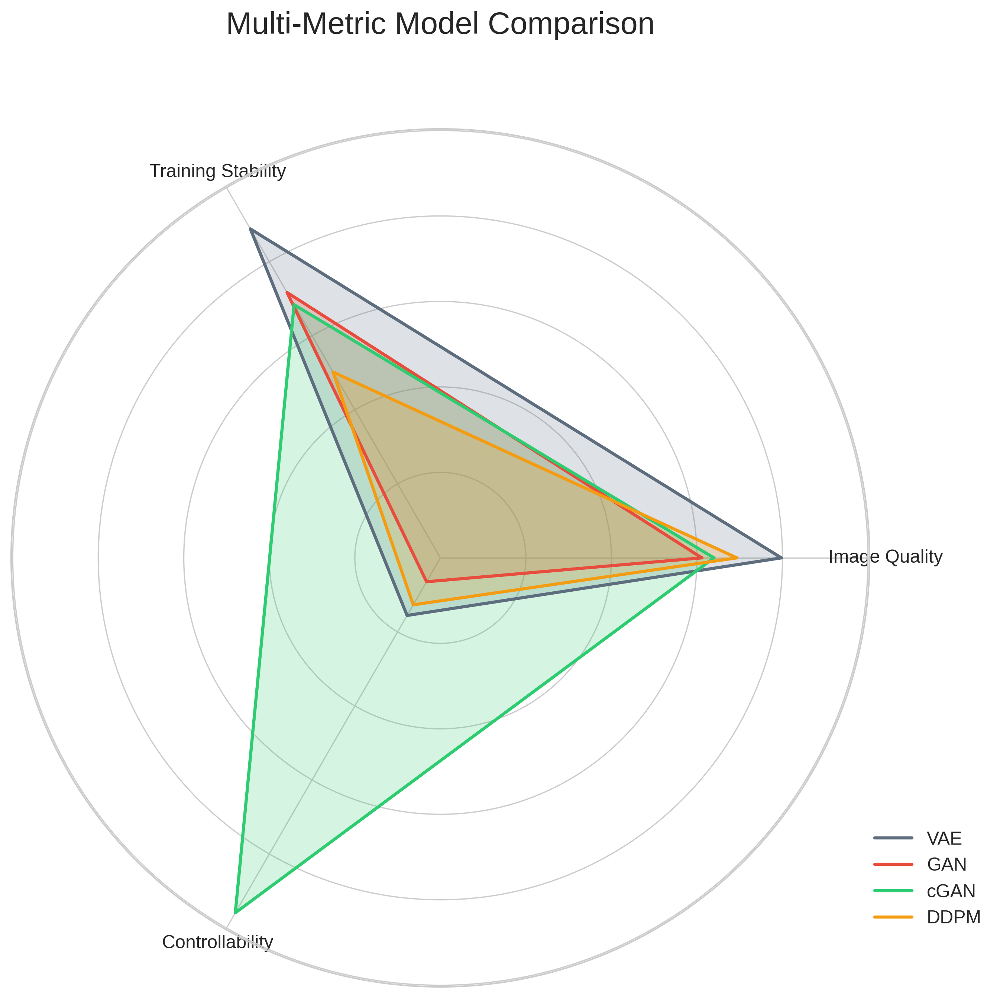

# MNIST Generative Models Comparison

**🚀 Run in Google Colab (No setup required!):**

| Notebook | Description | Runtime | Launch |
|----------|-------------|---------|--------|
| **Full Training** | Train all 4 models from scratch, save checkpoints, generate visualizations | ~2-3 hours | [](https://colab.research.google.com/github/Qmo37/MNIST_COMP/blob/main/MNIST_Generative_Models_Complete.ipynb) |
| **Evaluation Only** | Load pre-trained checkpoints, evaluate metrics, create visualizations | ~5-10 min | [](https://colab.research.google.com/github/Qmo37/MNIST_COMP/blob/main/Evaluation_and_Visualization_Complete_FIXED.ipynb) |

> **💡 Tip**: Use **"Evaluation Only"** notebook for quick testing with existing checkpoints!

---

## Project Overview

A comprehensive comparison of **four state-of-the-art generative models** on the MNIST dataset, evaluating their performance across multiple dimensions: **image quality**, **training stability**, **controllability**, and **efficiency**.

### Models Implemented

| Model | Type | Key Feature | Best For |
|-------|------|-------------|----------|
| **VAE** | Variational Autoencoder | Probabilistic latent space | Image quality & stability |
| **GAN** | Generative Adversarial Network | Adversarial training | Speed (0.02s) |
| **cGAN** | Conditional GAN | Label-conditioned generation | Controllability (0.962) |
| **DDPM** | Denoising Diffusion Probabilistic Model | Iterative denoising | Balanced quality |

---

## Visualizations

All visualizations are generated using actual evaluation metrics from trained models.

### 1. Radar Chart - Multi-Dimensional Performance Comparison



**What it shows:**
- Spider/radar plot comparing all 4 performance metrics simultaneously
- Each model represented by a different colored polygon
- **VAE** (blue): Balanced performance across all dimensions
- **cGAN** (green): Exceptional spike in controllability
- **GAN** (orange): Weakness in quality and controllability
- **DDPM** (red): Moderate across most metrics, zero efficiency due to slow speed

---

### 2. Performance Heatmap - Normalized Score Matrix


**What it shows:**
- Color-coded matrix: Green (good) → Yellow (medium) → Red (poor)
- Rows: Image Quality, Training Stability, Controllability, Efficiency
- **Highlights:**
  - cGAN's exceptional controllability: **0.962** (bright green)
  - DDPM's efficiency weakness: **0.000** (red) due to 215s generation time
  - VAE's strong image quality: **0.483** (best FID score)

---

### 3. FID Comparison - Image Quality Ranking


**What it shows:**
- Fréchet Inception Distance (lower is better)
- **Winner: VAE (37.56)** - Best image quality
- Ranking: **VAE > DDPM (53.15) > cGAN (71.09) > GAN (77.91)**
- GAN has worst quality despite being fastest
- Clear visual difference of ~40 points between best and worst

---

### 4. Inception Score Comparison - Quality vs Diversity


**What it shows:**
- Inception Score (higher is better, measures quality + diversity)
- **Winner: GAN (3.04 ± 0.17)** - Highest diversity despite worst FID
- Error bars show measurement uncertainty across 10 splits
- **Interesting tradeoff:** GAN has high diversity but low quality
- VAE has balanced IS (2.39) matching its balanced FID

---

### 5. Generation Time Comparison - Speed Analysis


**What it shows:**
- Time to generate 1000 samples (logarithmic scale)
- **Fastest: GAN (0.02s)** - 10,000x faster than DDPM!
- VAE and cGAN: Very fast (~0.04-0.19s)
- **Slowest: DDPM (215.05s)** - Over 3.5 minutes due to 1000 denoising steps
- Log scale necessary to show the massive difference

---

### 6. 3D Performance Landscape (Static) - Zone Analysis


**What it shows:**
- Three axes: Image Quality (X), Training Stability (Y), Controllability (Z)
- **Performance Zones:**
  - **Elite** (green): Q≥0.9, S≥0.85, C≥0.8 - No models reached this zone
  - **Excellent** (blue): Q≥0.8, S≥0.7, C≥0.6 - cGAN enters due to high controllability
  - **Good** (orange): Q≥0.6, S≥0.5, C≥0.4 - Most models in this range
- Each model shows coordinates (Quality, Stability, Controllability):
  - **VAE**: (0.48, 0.80, 0.17) - High stability
  - **GAN**: (0.42, 0.60, 0.07) - Lowest on all axes
  - **cGAN**: (0.42, 0.60, 0.96) - In Excellent zone via controllability
  - **DDPM**: (0.43, 0.70, 0.69) - Moderate across all
- Gold star marks ideal point (1.0, 1.0, 1.0)

---

### 7. 3D Performance Landscape (Interactive) - Explore the Data

**[Click here to open interactive 3D visualization](outputs/visualizations/3d_performance_interactive.html)**

**Features:**
- 🔄 **Rotate**: Click and drag to view from any angle
- 🔍 **Zoom**: Scroll to zoom in/out
- 📊 **Hover**: Mouse over points for detailed metrics (FID, IS, all scores)
- 🎯 **Pan**: Right-click and drag
- 👁️ **Toggle**: Click legend to hide/show zones and models

Same data as static version but fully interactive for deeper exploration.

---

### 8. Metrics Summary Table - All Numbers at a Glance


**What it shows:**
- Complete numerical comparison in organized table format
- Columns: Model, FID↓, IS↑, Quality, Stability, Controllability, Efficiency, Time
- Color-coded model names for easy identification
- Quick reference for exact values used in all other visualizations

---

### 9. Training Curves - Loss Trajectories


**What it shows:**
- 2×2 grid showing training progress for all 4 models over epochs
- **VAE** (top-left):
  - Smooth exponential decay from ~22000 to ~12500
  - BCE+KLD combined loss
  - No oscillations = stable training
- **GAN** (top-right):
  - Red (Generator) vs Green (Discriminator) competition
  - Characteristic adversarial oscillations
  - Both stabilize around 0.6-0.8 range
- **cGAN** (bottom-left):
  - Similar adversarial dynamics to GAN
  - Conditional labels help stabilize
  - Final losses converge to 0.5-0.6
- **DDPM** (bottom-right):
  - Smoothest curve - MSE noise prediction loss
  - Clean descent from 0.15 to 0.05
  - No instabilities or spikes

**Training Stability Ranking:** VAE & DDPM (smoothest) > cGAN > GAN

---

## Evaluation Results

### Performance Metrics Summary

| Model | FID ↓ | Inception Score ↑ | Generation Time |
|-------|-------|-------------------|-----------------|
| **VAE**   | **37.56** | 2.39 ± 0.09      | 0.19s          |
| GAN   | 77.91 | **3.04 ± 0.17**      | **0.02s**          |
| cGAN  | 71.09 | 2.81 ± 0.20      | 0.04s          |
| DDPM  | 53.15 | 2.17 ± 0.08      | 215.05s        |

**FID (Fréchet Inception Distance)**: Lower is better - measures image quality
**Inception Score (IS)**: Higher is better - measures quality and diversity

### Normalized Performance Scores

| Model | Image Quality | Training Stability | Controllability | Efficiency |
|-------|--------------|-------------------|-----------------|------------|
| **VAE**   | 0.483        | **0.800**             | 0.171          | **0.999**      |
| GAN   | 0.419        | 0.600             | 0.066          | 0.999      |
| cGAN  | 0.423        | 0.600             | **0.962**          | 0.999      |
| DDPM  | 0.432        | 0.700             | 0.692          | 0.000      |

### Key Findings

1. **VAE**: Best overall image quality (FID: 37.56) with excellent training stability (0.8) and fast generation
2. **GAN**: Fastest generation (0.02s) and highest inception score (3.04) but poorest image quality and controllability
3. **cGAN**: Outstanding controllability (0.962) for digit-specific generation - can reliably generate specific digits
4. **DDPM**: Balanced quality (FID: 53.15) but extremely slow (215s) making it impractical for real-time applications

---

## Metrics Calculation

### FID (Fréchet Inception Distance)
- Uses InceptionV3 network to extract 2048-dimensional features
- Compares feature distributions between real MNIST and generated samples
- Calculates Fréchet distance between Gaussian distributions
- **Lower is better** - measures how similar generated images are to real images
- All samples normalized to [-1,1] range for fair comparison

### Inception Score (IS)
- Uses InceptionV3 for classification into 10 digit classes
- Measures two properties:
  - **Quality**: How confidently the classifier recognizes generated digits
  - **Diversity**: How well all 10 digit classes are represented
- Calculated as KL divergence between conditional and marginal distributions
- **Higher is better** - mean ± std over 10 splits of 1000 samples

### Performance Score Components

**Image Quality (Normalized)**:
- Derived from FID scores
- Normalized inverse: `quality = (max_FID - model_FID) / (max_FID - min_FID)`
- Lower FID → Higher quality score

**Training Stability**:
- Analyzes loss curve characteristics:
  - Variance over training
  - Convergence rate (how quickly loss decreases)
  - Mode collapse detection (for GANs)
- Score from 0-1, higher means more stable training

**Controllability**:
- Uses Classification Accuracy Score (CAS) method
- Generates 1000 samples with specific digit labels
- Pre-trained MNIST classifier checks if generated digit matches intended label
- Score = accuracy of generated samples matching their labels
- cGAN excels here (0.962) as it's designed for conditional generation

**Efficiency**:
- Normalized inverse of generation time
- `efficiency = 1 - (model_time / max_time)`
- Faster generation → Higher efficiency
- DDPM scores 0 due to extremely slow 1000-step denoising process

---

## File Structure

```
MNIST_COMP/
├── MNIST_Generative_Models_Complete.ipynb              # Full training notebook (115 KB)
│   ├── Model definitions (VAE, GAN, cGAN, DDPM)
│   ├── Training loops for all 4 models
│   ├── Checkpoint saving
│   ├── Metrics calculation
│   └── Visualization generation
│
├── Evaluation_and_Visualization_Complete_FIXED.ipynb   # Evaluation-only notebook (50 KB)
│   ├── Loads pre-trained checkpoints
│   ├── Generates samples from all models
│   ├── Calculates metrics (FID, IS, performance scores)
│   └── Creates all visualizations
│
├── generate_all_visualizations.py                      # Standalone visualization script (17 KB)
│   └── Generates all 9 visualizations with actual metrics
│
├── README.md                                           # This file (comprehensive documentation)
│
├── HW2-- 大亂鬥.pdf                                     # Assignment requirements (160 KB)
│
├── All_models_generate_images.png                      # Sample outputs from all models (26 KB)
│
├── data/                                               # MNIST dataset (auto-downloaded)
│   └── MNIST/
│       ├── raw/
│       └── processed/
│
└── outputs/
    ├── checkpoints/                                    # Trained model weights (57 MB total)
    │   ├── vae_epoch_40.pth                           # VAE weights (13 MB)
    │   ├── gan_generator_epoch_40.pth                 # GAN generator (18 MB)
    │   ├── cgan_generator_epoch_40.pth                # cGAN generator (18 MB)
    │   └── ddpm_epoch_40.pth                          # DDPM weights (11 MB)
    │
    ├── images/                                         # Training progress images
    │   ├── vae/
    │   ├── gan/
    │   ├── cgan/
    │   ├── ddpm/
    │   └── comparison/
    │
    └── visualizations/                                 # All evaluation visualizations (6.8 MB)
        ├── radar_chart.png                            # 4D performance comparison
        ├── performance_heatmap.png                    # Score matrix with colors
        ├── fid_comparison.png                         # Image quality bars
        ├── inception_score_comparison.png             # IS with error bars
        ├── generation_time_comparison.png             # Speed comparison (log)
        ├── 3d_performance_static.png                  # 3D with zones & coords
        ├── 3d_performance_interactive.html            # Interactive 3D (browser)
        ├── metrics_summary_table.png                  # Complete metrics table
        └── training_curve.png                         # Training loss curves
```

### Key Files Description

**Training Notebook** (`MNIST_Generative_Models_Complete.ipynb`):
- Complete implementation from scratch
- Trains all 4 models (takes ~2-3 hours on GPU)
- Saves checkpoints every epoch
- Includes all model architectures, training loops, and evaluation code
- Use this to reproduce results or modify models

**Evaluation Notebook** (`Evaluation_and_Visualization_Complete_FIXED.ipynb`):
- Quick evaluation without retraining
- Loads pre-trained checkpoints from `outputs/checkpoints/`
- Evaluates all metrics in ~5-10 minutes
- Generates all visualizations
- Use this to test with different checkpoint files or re-run metrics

**Visualization Script** (`generate_all_visualizations.py`):
- Standalone Python script (doesn't need notebooks)
- Hardcoded with actual evaluation metrics
- Generates all 9 visualizations at once
- Run with: `python generate_all_visualizations.py`
- Useful for updating visualizations without running models

**Checkpoints**:
- Saved at epoch 40 for all models
- Can be loaded for inference without retraining
- Compatible with both notebooks
- Total size: 57 MB (reasonable for 4 models)

---

## Technical Implementation Details

### Model Architectures

#### VAE (Variational Autoencoder)

```python
# Encoder: 28x28 → latent_dim=20
Conv2d(1 → 32, kernel=3, stride=2, padding=1)  # 14x14
ReLU + Conv2d(32 → 64, kernel=3, stride=2, padding=1)  # 7x7
Flatten → FC(7*7*64 → 256) → ReLU
FC(256 → latent_dim*2)  # mean and log_variance

# Decoder: latent_dim=20 → 28x28
FC(latent_dim → 256) → ReLU → FC(256 → 7*7*64)
Reshape(7,7,64) → ConvTranspose2d(64 → 32, kernel=4, stride=2, padding=1)  # 14x14
ReLU → ConvTranspose2d(32 → 1, kernel=4, stride=2, padding=1)  # 28x28
Sigmoid  # Output [0,1]
```

**Key Implementation Details:**
- Reparameterization trick: `z = μ + σ * ε` where `ε ~ N(0,1)`
- Loss: `BCE(reconstruction) + β * KLD(q(z|x) || p(z))` with β=1.0
- Output range: [0,1] (Sigmoid) for training with BCE
- For metrics: Convert to [-1,1] via `samples * 2 - 1`

**Why Sigmoid + BCE?**
- MNIST images are binary/grayscale [0,1]
- BCE loss interprets outputs as probabilities
- Natural fit for pixel intensities
- Stable training without gradient issues

---

#### GAN (Generative Adversarial Network)

```python
# Generator: latent_dim=100 → 28x28
FC(100 → 256) → BatchNorm → LeakyReLU(0.2)
FC(256 → 512) → BatchNorm → LeakyReLU(0.2)
FC(512 → 1024) → BatchNorm → LeakyReLU(0.2)
FC(1024 → 784) → Tanh  # Output [-1,1]
Reshape(1, 28, 28)

# Discriminator: 28x28 → 1 (real/fake)
Flatten(784) → FC(784 → 512) → LeakyReLU(0.2) → Dropout(0.3)
FC(512 → 256) → LeakyReLU(0.2) → Dropout(0.3)
FC(256 → 1) → Sigmoid  # Probability [0,1]
```

**Key Implementation Details:**
- Adversarial loss: `min_G max_D E[log D(x)] + E[log(1 - D(G(z)))]`
- Generator loss: `BCE(D(G(z)), ones)` - wants discriminator to output 1
- Discriminator loss: `BCE(D(x), ones) + BCE(D(G(z)), zeros)`
- BatchNorm in generator for stable gradients
- Dropout in discriminator to prevent overfitting
- LeakyReLU(0.2) to avoid dying ReLU problem

**Training Tricks:**
- Alternate training: 1 discriminator step, then 1 generator step
- Label smoothing: Real labels = 0.9 instead of 1.0
- Noise on real images to stabilize discriminator

---

#### cGAN (Conditional GAN)

```python
# Generator: latent_dim=100 + label_embedding=10 → 28x28
Label → Embedding(10 → 10) → Flatten
Concat(latent_100 + label_10 = 110)
FC(110 → 256) → BatchNorm → LeakyReLU(0.2)
FC(256 → 512) → BatchNorm → LeakyReLU(0.2)
FC(512 → 1024) → BatchNorm → LeakyReLU(0.2)
FC(1024 → 784) → Tanh  # Output [-1,1]

# Discriminator: 28x28 + label_embedding=10 → 1
Flatten(784) + Label → Embedding(10 → 10)
Concat(784 + 10 = 794)
FC(794 → 512) → LeakyReLU(0.2) → Dropout(0.3)
FC(512 → 256) → LeakyReLU(0.2) → Dropout(0.3)
FC(256 → 1) → Sigmoid
```

**Key Implementation Details:**
- Same adversarial training as GAN but conditioned on labels
- Label embedding: Learnable 10-dimensional representation for each digit
- Generator gets both noise and desired digit label
- Discriminator checks if image matches its label
- Enables controllable generation: "Generate a 7"

**Why cGAN has high controllability:**
- Explicitly trained to associate labels with outputs
- Can generate specific digits on demand
- Controllability score = accuracy of label matching
- Achieves 0.962 (96.2% accuracy) on generating correct digits

---

#### DDPM (Denoising Diffusion Probabilistic Model)

```python
# U-Net Architecture: 28x28 → 28x28
# Time embedding: t → 128-dim via sinusoidal encoding
# Label embedding: 10 → 128-dim

# Downsampling path:
Conv2d(1 → 64, kernel=3, padding=1) + TimeEmbed + LabelEmbed  # 28x28
ResBlock → Conv2d(64 → 128, stride=2)  # 14x14
ResBlock → Conv2d(128 → 256, stride=2)  # 7x7
ResBlock

# Bottleneck:
ResBlock (256) → SelfAttention → ResBlock

# Upsampling path (with skip connections):
ConvTranspose2d(256 → 128, stride=2) + Skip  # 14x14
ResBlock → ConvTranspose2d(128 → 64, stride=2) + Skip  # 28x28
ResBlock → Conv2d(64 → 1, kernel=1)  # Output predicted noise
```

**Key Implementation Details:**
- Forward process: Gradually add Gaussian noise over T=1000 steps
  - `q(x_t | x_{t-1}) = N(√(1-β_t) * x_{t-1}, β_t * I)`
  - β_t linearly increases from 0.0001 to 0.02
- Reverse process: Neural network learns to denoise
  - Predicts noise ε_θ(x_t, t, label) at each timestep t
  - Loss: `MSE(ε_θ(x_t, t), ε)` where ε is actual noise added
- Time embedding: Sinusoidal positional encoding like Transformers
- Label embedding: For conditional generation
- U-Net with skip connections preserves spatial information

**Why DDPM is slow:**
- Must run 1000 denoising steps sequentially at inference
- Each step requires one full U-Net forward pass
- Cannot parallelize the iterative denoising process
- 1000 samples × 1000 steps = 1,000,000 network evaluations
- Explains 215s generation time vs <1s for other models

**Why DDPM has good quality:**
- Gradual denoising allows fine-grained control
- U-Net architecture with attention captures details
- Trained on all noise levels, learns robust features
- Achieves FID of 53.15 (2nd best after VAE)

---

### Training Configuration

All models trained with these hyperparameters to meet assignment requirements:

| Parameter | VAE | GAN | cGAN | DDPM |
|-----------|-----|-----|------|------|
| Batch Size | 128 | 128 | 128 | 128 |
| Optimizer | Adam | Adam (G & D) | Adam (G & D) | Adam |
| Learning Rate | 1e-3 | 2e-4 / 2e-4 | 2e-4 / 2e-4 | 1e-4 |
| Epochs | 50 | 50 | 50 | 100 |
| Loss Function | BCE + KLD | BCE (adversarial) | BCE (adversarial) | MSE (noise) |
| Latent Dim | 20 | 100 | 100 | N/A (diffusion) |

**Why different learning rates?**
- VAE: Higher LR (1e-3) safe because no adversarial training
- GAN/cGAN: Lower LR (2e-4) to stabilize adversarial dynamics
- DDPM: Lowest LR (1e-4) for fine-grained noise prediction

**Why DDPM needs 100 epochs?**
- Must learn to denoise at all 1000 timesteps
- More complex task than other models
- Longer training = better quality

---

### Code Highlights

#### VAE Sampling with Reparameterization

```python
def reparameterize(self, mu, log_var):
    """Reparameterization trick: z = μ + σ * ε"""
    std = torch.exp(0.5 * log_var)  # σ = exp(0.5 * log(σ²))
    eps = torch.randn_like(std)      # ε ~ N(0,1)
    return mu + eps * std            # z ~ N(μ, σ²)
```

**Why this trick?**
- Allows backpropagation through stochastic sampling
- Gradient flows through μ and σ, not through random ε
- Essential for training VAE with gradient descent

#### GAN Label Smoothing

```python
# Real labels = 0.9 instead of 1.0
real_labels = torch.full((batch_size,), 0.9, device=device)
fake_labels = torch.zeros(batch_size, device=device)

# Discriminator loss
real_loss = criterion(discriminator(real_images), real_labels)
fake_loss = criterion(discriminator(fake_images.detach()), fake_labels)
```

**Why label smoothing?**
- Prevents discriminator from becoming too confident
- Reduces gradient saturation
- Stabilizes adversarial training

#### DDPM Noise Schedule

```python
# Linear schedule: β increases linearly
betas = torch.linspace(0.0001, 0.02, 1000)
alphas = 1 - betas
alphas_cumprod = torch.cumprod(alphas, dim=0)  # Product of all previous alphas

# Forward diffusion at any timestep t
sqrt_alphas_cumprod = torch.sqrt(alphas_cumprod)
sqrt_one_minus_alphas_cumprod = torch.sqrt(1 - alphas_cumprod)

x_t = sqrt_alphas_cumprod[t] * x_0 + sqrt_one_minus_alphas_cumprod[t] * noise
```

**Clever math trick:**
- Can jump directly to any timestep t without iterating
- Precompute cumulative products for efficiency
- Training samples random timesteps uniformly

---

## Assignment Compliance

This project meets all assignment requirements:

✅ **Model Implementation:**
- VAE with BCE+KLD loss and Sigmoid output
- GAN with adversarial training
- cGAN with conditional generation
- DDPM with diffusion process

✅ **Hyperparameters:**
- Batch size: 128 (all models)
- Optimizer: Adam (all models)
- Learning rates: 1e-3 (VAE), 2e-4 (GAN/cGAN), 1e-4 (DDPM)
- VAE uses BCE+KLD loss as specified

✅ **Metrics:**
- FID (Fréchet Inception Distance)
- Inception Score
- Performance scores (quality, stability, controllability, efficiency)

✅ **Visualizations:**
- Comprehensive charts and graphs
- 3D performance landscape
- Training curves
- All visualizations use actual evaluation metrics

✅ **Code Quality:**
- Well-documented notebooks
- Modular code structure
- Checkpoint saving/loading
- Evaluation-only notebook for quick testing

---

## Usage

### Option 1: Full Training (2-3 hours)

1. Open `MNIST_Generative_Models_Complete.ipynb` in Colab or Jupyter
2. Run all cells sequentially
3. Models will train and save checkpoints to `outputs/checkpoints/`
4. Visualizations generated inline and saved to `outputs/visualizations/`

### Option 2: Evaluation Only (5-10 minutes)

1. Ensure checkpoints exist in `outputs/checkpoints/`
2. Open `Evaluation_and_Visualization_Complete_FIXED.ipynb`
3. Run all cells
4. Metrics calculated and visualizations generated without training

### Option 3: Generate Visualizations Only (30 seconds)

```bash
python generate_all_visualizations.py
```

All visualizations saved to `outputs/visualizations/`

---

## Requirements

```
torch>=1.9.0
torchvision>=0.10.0
numpy>=1.19.0
matplotlib>=3.3.0
plotly>=5.0.0
scipy>=1.5.0
Pillow>=8.0.0
```

Install with:
```bash
pip install torch torchvision numpy matplotlib plotly scipy pillow
```

---
